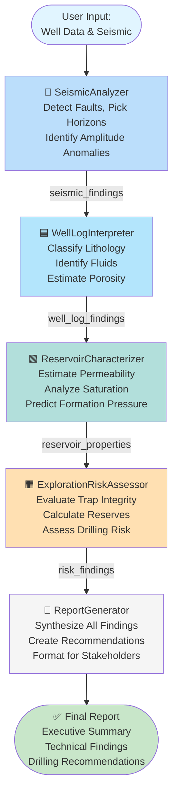
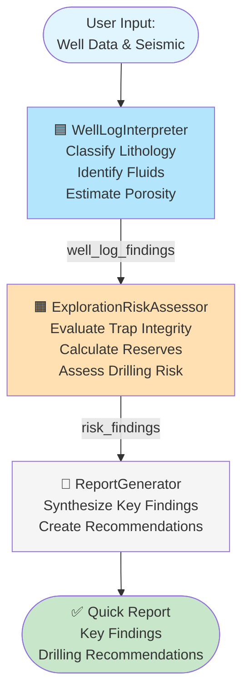
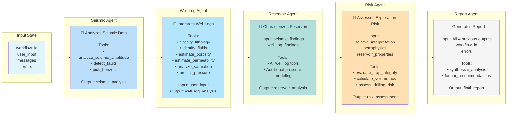
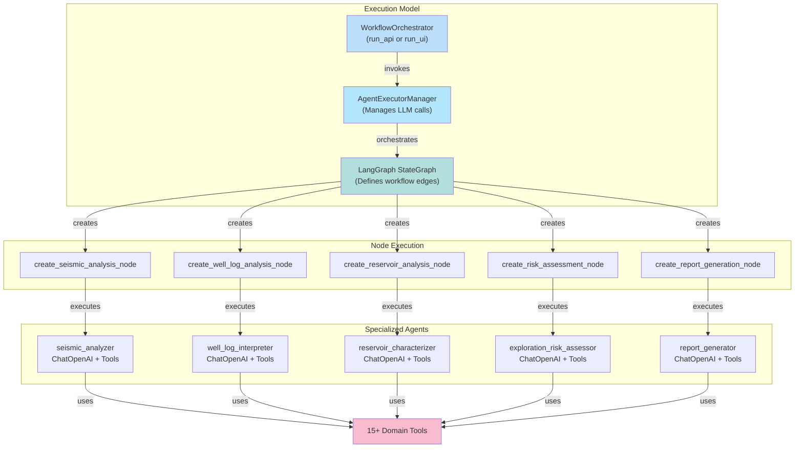
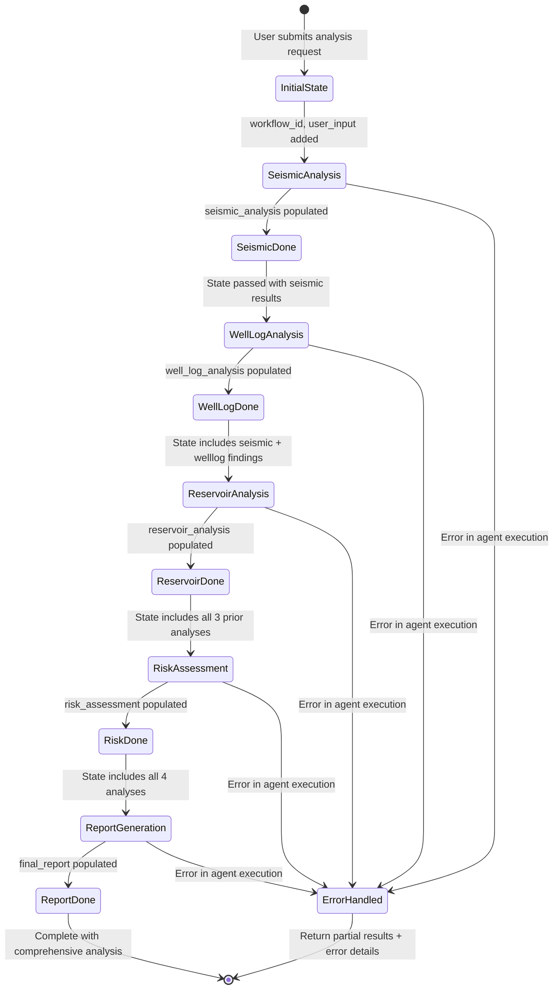
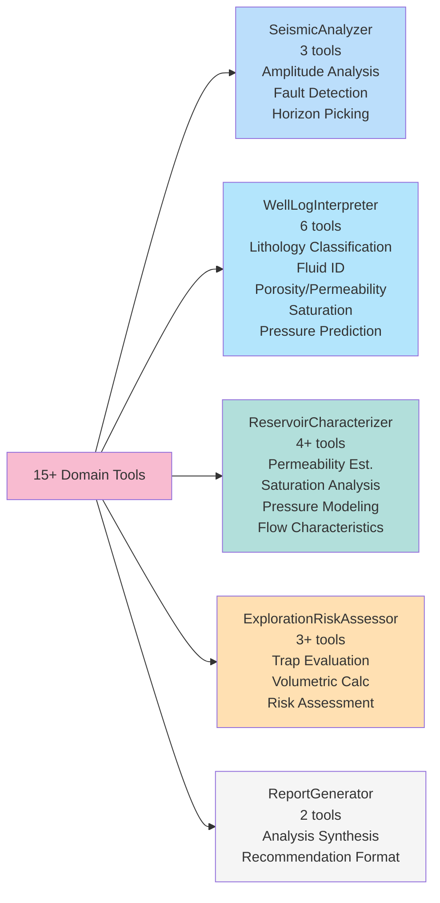
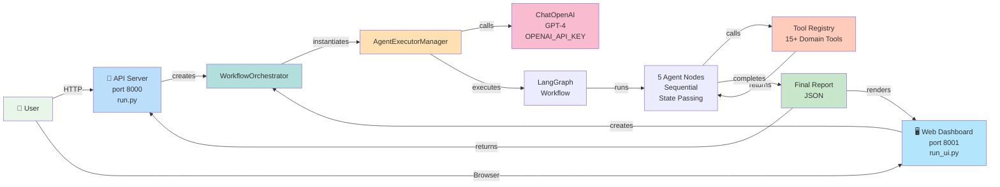

# 🧠 Multi-Agent Interaction Architecture

## 📊 Full Analysis Workflow (5 Agents)



---

## ⚡ Quick Analysis Workflow (3 Agents)



---

## 🔄 Agent Data Flow & State Management



---

## 🎯 Agent Coordination Mechanism



---

## 📤 Complete State Transitions



---

## 🛠️ Tool Distribution Across Agents



---

## 📋 Agent Specialization & Responsibilities

| Agent | Role | Input Dependencies | Output | Tools Used |
|-------|------|-------------------|--------|-----------|
| **SeismicAnalyzer** 🔷 | Subsurface interpretation | User seismic data | Fault maps, horizon picks | 3 seismic tools |
| **WellLogInterpreter** 🟦 | Petrophysics analysis | User well log data | Lithology, fluids, porosity | 6 well log tools |
| **ReservoirCharacterizer** 🟩 | Property estimation | Seismic + well log findings | Permeability, saturation, pressure | 4+ reservoir tools |
| **ExplorationRiskAssessor** 🟧 | Risk & volumetrics | All prior analyses | Reserves, trap integrity, risk score | 3+ risk tools |
| **ReportGenerator** 📄 | Synthesis & recommendations | All 4 analyses + errors | Executive summary, recommendations | 2 formatting tools |

---

## 🔗 Data Flow Example: Full Analysis

```
User Input:
├── well_name: "Northfield-1"
├── seismic_data: [amplitude values, depth]
└── well_log_data: [gamma_ray, resistivity, porosity]

↓ SeismicAnalyzer executes

seismic_analysis:
├── amplitude_anomalies: [...]
├── fault_structures: [...]
└── horizon_picks: [...]

↓ WellLogInterpreter executes

well_log_analysis:
├── lithology_classes: [...]
├── fluid_types: [...]
└── porosity_estimates: [...]

↓ ReservoirCharacterizer receives BOTH seismic_analysis + well_log_analysis

reservoir_analysis:
├── permeability_model: [...]
├── saturation_distribution: [...]
└── formation_pressure: [...]

↓ ExplorationRiskAssessor receives seismic + welllog + reservoir data

risk_assessment:
├── trap_integrity_score: 0.85
├── volumetric_estimate: 50MMBbl
└── drilling_risk: HIGH

↓ ReportGenerator synthesizes ALL findings

final_report:
├── executive_summary: "High-confidence structural trap..."
├── technical_findings: [consolidated results]
└── drilling_recommendations: ["Drill at 3500m TVD"]

Output delivered to user via API or Dashboard
```

---

## 🎛️ Workflow Orchestration Details

### **Execution Model**
- **LangGraph-based state machine** with 5-node directed graph
- **Sequential execution** with state carry-over between agents
- **Error handling** at each node (errors collected in state list)
- **Message logging** for audit trail and debugging

### **State Management** (AnalysisState)
- `workflow_id`: Unique execution identifier
- `user_input`: Original analysis request
- `seismic_analysis`: 1st agent output
- `well_log_analysis`: 2nd agent output
- `reservoir_analysis`: 3rd agent output
- `risk_assessment`: 4th agent output
- `final_report`: 5th agent output (synthesis)
- `messages`: Execution log (timestamps, completion status)
- `errors`: Error collection (for resilience)

### **Recovery Mechanism**
- Each agent captures errors in state without stopping workflow
- Final report includes error summary
- Partial results returned to user if errors occur
- Allows graceful degradation instead of complete failure

---

## 🚀 Deployment Architecture



