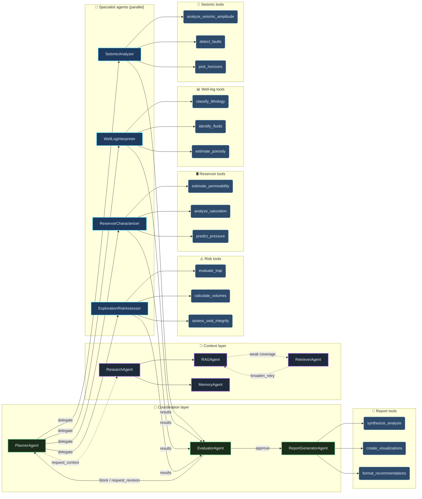
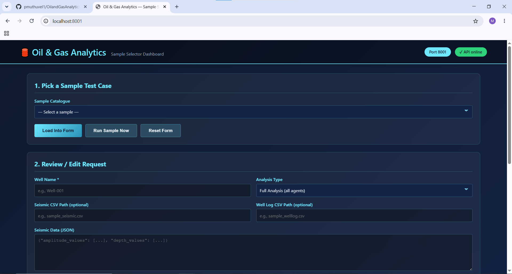
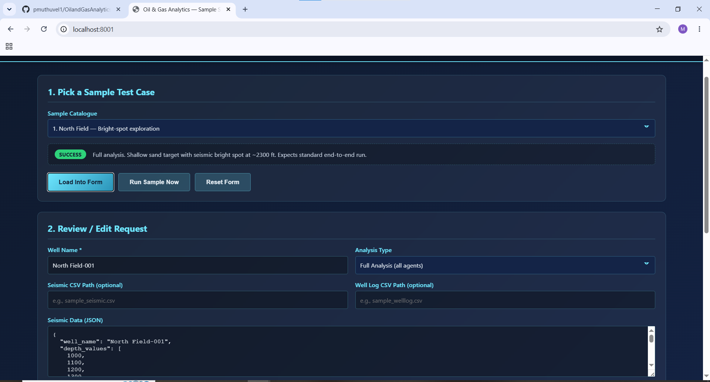
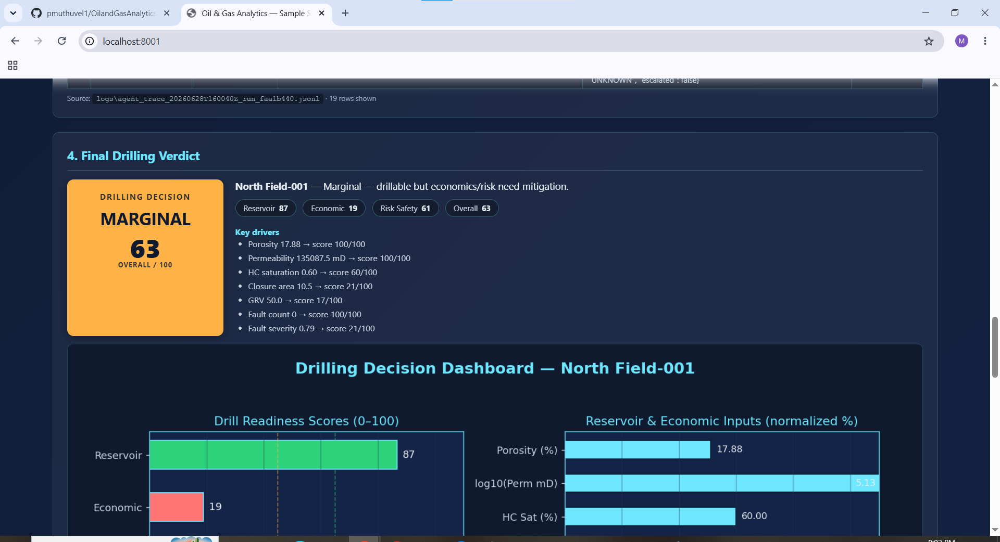

# Oil & Gas Analytics — Multi-Agent System

[](.github/workflows/ci.yml)
[](https://www.python.org/downloads/)
[](LICENSE)
[](docs/SAMPLE_MODE.md)

Production-grade, agent-collaborative analytics for oil & gas exploration —
seismic interpretation, well-log petrophysics, reservoir characterization,
and risk assessment, orchestrated by a Planner → Executor → Evaluator loop
with shared memory, RAG, persistent memory, and live-API ↔ sample-mode
escalation.

Geologost and pertophysits has to understand large sets of Numerical Data to 
arive at **DRILL / MARGINAL / DO_NOT_DRILL** decision on a well. any small mistake can cause Millions in Loss.
as Human can mis-interprest a NO DRILLING Location as DRILLING and DRILLING location as NO DRILLING, causing millions.
this Agentic AI Solution will provide accurate Analysis result. 
```
                ┌──────────────┐
       ┌────────│   Planner    │◀──────────────┐  request_revision
       │        └──────┬───────┘               │
       │               │ delegate              │
       ▼               ▼                       │
┌──────────────┐  ┌──────────────┐  …   ┌──────┴───────┐
│   Research   │  │   Specialist │      │   Evaluator  │
│  + Retriever │  │    Agents    │─────▶│  (critique)  │
└──────────────┘  └──────────────┘      └──────┬───────┘
       ▲                                       │ approve
       │ broaden_retry                         ▼
       │                              ┌──────────────────┐
       └─────────  shared memory ────▶│  Report Writer   │
                                      └──────────────────┘
```

---

## Problem Statement

**Use Case ID:** 4

**Problem:** Oil & Gas Seismic Data and Well Information Analyser for drilling.

In Oil and Gas Industries, Geologists and Petrophysicists must analyze vast volumes of complex numerical and geological data to determine whether a well should be classified as **DRILL**, **MARGINAL**, or **DO_NOT_DRILL**. These decisions are critical, as even a minor interpretation error can result in millions of dollars in financial losses.

Traditional human-driven analysis is susceptible to errors caused by data complexity, cognitive bias, fatigue, or oversight. A potentially profitable drilling location may be incorrectly classified as **DO_NOT_DRILL**, leading to missed revenue opportunities. Conversely, a non-viable location may be mistakenly approved for drilling, resulting in significant capital expenditure and operational losses.

This Agentic AI solution addresses these challenges by systematically analyzing large-scale geological, petrophysical, and operational datasets with speed, consistency, and precision. By reducing the risk of human misinterpretation, the platform delivers highly accurate and explainable recommendations, enabling more confident **DRILL**, **MARGINAL**, and **DO_NOT_DRILL** decisions while minimizing financial and operational risk.


---

## Solution Overview

A production-grade multi-agent system that ingests seismic + well-log data
(inline JSON, CSV, or LAS) and orchestrates a **Planner → Research →
Specialist Executors → Evaluator → Report Writer** workflow to produce a
drilling decision.

What it ships out of the box:

- **15+ deterministic domain tools** (amplitude analysis, fault detection,
  horizon picking, lithology, fluid ID, porosity / permeability / saturation,
  pressure prediction, volumetrics, risk scoring, …).
- **Five specialist agents** plus Planner, Evaluator, Research / Retriever,
  RAG, Memory, and Report-Generator agents — each emitting trace records
  with `agent_name`, `action`, `target_agent`, `confidence`, `status`.
- **Critique / retry / escalation loops** controlled from `.env`
  (`MAX_AGENT_ITERATIONS`, `MAX_ITERATIONS`), with auto-escalation to
  deterministic `SAMPLE_MODE` after repeated live-API failures.
- **REST API** (`POST /run`, alias `POST /analyze`), **CLI**
  (`python cli.py run …`), and a **browser UI** with a sample-test-data
  dropdown, an agent-collaboration trace table, a matplotlib decision
  dashboard, and a final-verdict card.
- **`use_case_id` round-trip** — every input / output example carries
  `use_case_id` as its first field; the live API echoes it back at the top
  level for end-to-end tracking.
- **SAMPLE_MODE** that runs the full multi-agent flow with **no API key**
  (perfect for demos and CI), plus a Compass-ready live LLM path.

---

## Architecture

High-level control flow — the Planner delegates, Specialists execute,
the Evaluator critiques, and either approves or sends the work back for
one more iteration (bounded by `MAX_AGENT_ITERATIONS`):

```
                ┌──────────────┐
       ┌────────│   Planner    │◀──────────────┐  request_revision
       │        └──────┬───────┘               │   (loops up to MAX_AGENT_ITERATIONS)
       │               │ delegate              │
       ▼               ▼                       │
┌──────────────┐  ┌──────────────┐       ┌─────┴────────┐
│  Research +  │  │  Specialist  │       │  Evaluator   │
│  Retriever / │  │  Agents      │──────▶│  (critique + │
│  RAG / Memory│  │  (parallel)  │       │   gate)      │
└──────┬───────┘  └──────────────┘       └──────┬───────┘
       │ broaden_retry on weak RAG              │ approve
       │                                        ▼
       └─────────  shared memory  ─────▶ ┌──────────────────┐
                                         │  Report Writer   │
                                         │ (blocked unless  │
                                         │  may_publish)    │
                                         └──────────────────┘
```

1. **Plan** — `PlannerAgent` picks specialists based on the inputs present
   (`seismic_data`, `well_log_data`), prior `evaluation.weak_outputs`,
   `risk_level==HIGH`, and current RAG coverage.
2. **Research** — `ResearchAgent` loads local CSV / LAS evidence; `RAGAgent`
   pulls top-k chunks; `MemoryAgent` recalls prior runs for this well.
3. **Execute (parallel)** — `SeismicAnalyzer` and `WellLogInterpreter` run
   concurrently via `asyncio.gather`; `ReservoirCharacterizer` and
   `ExplorationRiskAssessor` chain after them (dependency-aware).
4. **Evaluate** — `EvaluatorAgent` computes `quality_score` from tool
   success, synthesis success, evidence count, RAG coverage, and missing
   inputs, and sets `report_gate.may_publish`.
5. **Iterate / Finalize** — if `!approved`, the Planner re-runs the cycle
   (broaden RAG, reload context, retry specialists). When approved,
   `ReportGeneratorAgent` produces the final synthesis; otherwise the
   response is marked `status: "blocked"` with the blocking reasons exposed.

### Layered view

| Layer | Responsibility | Modules |
| ----- | -------------- | ------- |
| **Coordination** | Planning, evaluation, role-authority gating, report synthesis | `app/agents.py` (Planner / Evaluator / ReportGenerator / `AgentExecutorManager`) |
| **Context** | Local data, RAG embeddings, persistent cross-run memory | `app/data_sources.py`, `app/rag.py`, `app/memory.py` |
| **Specialists** | Seismic / well-log / reservoir / risk reasoning | `app/agents.py` (`SeismicAnalyzer`, `WellLogInterpreter`, `ReservoirCharacterizer`, `ExplorationRiskAssessor`) |
| **Tools** | 15+ deterministic domain functions | `app/tools.py`, `app/petrophysics.py` |
| **Surface** | REST API, CLI, browser UI | `run.py` (FastAPI, port 8000), `cli.py`, `run_ui.py` (browser UI, port 8001) |
| **Observability** | Per-run JSONL traces, structured events, persistent memory | `app/logging_utils.py`, `app/observability.py`, `app/logging_config.py` |

Full architecture document: [docs/ARCHITECTURE.md](docs/ARCHITECTURE.md).

---

## Agents & Tools interaction

### Agents

| Agent | Role | Key trace actions |
| ----- | ---- | ----------------- |
| **PlannerAgent** | Dynamic delegation — picks which specialists to run based on available evidence, prior critique, and RAG coverage. Triggers revision cycles. | `workflow_start`, `delegate`, `revision_requested`, `workflow_end` |
| **ResearchAgent** | Loads local CSV / SEAM LAS evidence, normalizes inputs, and adds the SEG/SEAM open-data catalog for validation. | `load_context` |
| **RetrieverAgent** | Broadens the RAG query when coverage is `empty`/`weak`. Implements the retry loop. | `broaden_retry` |
| **RAGAgent** | Tiny on-disk RAG over Compass embeddings; injects top-k chunks into shared memory. | `retrieve` |
| **MemoryAgent** | Recalls prior runs for the same well/asset from `logs/persistent_memory.json`. | `recall` |
| **SeismicAnalyzer** | Tool-first seismic interpretation: amplitude stats, anomaly / bright-spot detection, fault detection, horizon picking. | `execute` |
| **WellLogInterpreter** | Petrophysics: lithology, fluid ID, porosity, permeability, saturation, pressure. | `execute` |
| **ReservoirCharacterizer** | Integrates seismic + petrophysics into reservoir-quality and producibility view. | `execute` |
| **ExplorationRiskAssessor** | Trap / seal / volumetric / risk scoring; outputs `risk_level`. | `execute` |
| **EvaluatorAgent** | Independent critique. Scores `quality_score`, derives `risk_level`, and can **block** the Report Writer via `report_gate` until the quality threshold is met. | `evaluate`, `block_report_writer` |
| **ReportGeneratorAgent** | Synthesizes the final executive + technical answer, citing tool outputs. Honors the evaluator's gate. | `produce_final_answer` |
| **AgentExecutorManager** | Orchestrator that owns the per-run trace file, escalation state, and Compass LLM clients. | `llm_config_resolved`, `llm_call`, `llm_call_skipped`, `llm_call_failed` |

Agent prompts and tool bindings live in [`app/agents.py`](app/agents.py)
(`AGENT_INSTRUCTIONS`, `AGENT_CONFIGS`).

### Tools

All registered tools live in [`app/tools.py`](app/tools.py) and are wired
to agents through `AGENT_CONFIGS` in [`app/config.py`](app/config.py).
Every tool is **deterministic** — identical input ⇒ identical output, so
`SAMPLE_MODE` can run the full workflow without a single LLM call.

| Category | Tool | Used by | What it does |
| -------- | ---- | ------- | ------------ |
| 🌊 **Seismic** | `analyze_seismic_amplitude` | `SeismicAnalyzer` | Amplitude stats + anomaly / bright-spot detection |
| 🌊 **Seismic** | `detect_faults` | `SeismicAnalyzer` | Fault-structure detection (`fault_count`, `fault_severity`, `risk_level`) |
| 🌊 **Seismic** | `pick_horizons` | `SeismicAnalyzer` | Top-N reflector picking for structure mapping |
| 📊 **Well-log** | `classify_lithology` | `WellLogInterpreter` | Lithology from gamma-ray + resistivity (`sand` / `shale` / `carbonate`) |
| 📊 **Well-log** | `identify_fluids` | `WellLogInterpreter` | Fluid ID (`oil` / `gas` / `water` / `mixed`) |
| 📊 **Well-log** | `estimate_porosity` | `WellLogInterpreter` | Avg / max porosity + reservoir-quality class |
| 🛢️ **Reservoir** | `estimate_permeability` | `ReservoirCharacterizer` | mD + permeability class (Kozeny-Carman style estimation) |
| 🛢️ **Reservoir** | `analyze_saturation` | `ReservoirCharacterizer` | Sw / Sh distribution + pay-zone qualifier |
| 🛢️ **Reservoir** | `predict_pressure` | `ReservoirCharacterizer` | Hydrostatic gradient + overpressure detection |
| ⚠️ **Risk** | `evaluate_trap` | `ExplorationRiskAssessor` | Trap geometry + integrity score |
| ⚠️ **Risk** | `calculate_volumes` | `ExplorationRiskAssessor` | OOIP / OGIP / recoverable volumes from GRV × ϕ × Sh × RF |
| ⚠️ **Risk** | `assess_seal_integrity` | `ExplorationRiskAssessor` | Seal-rock integrity + cap-rock confidence |
| 📝 **Report** | `synthesize_analysis` | `ReportGeneratorAgent` | Cross-discipline synthesis of all agent findings |
| 📝 **Report** | `create_visualizations` | `ReportGeneratorAgent` | Plot specs consumed by the dashboard's matplotlib renderer |
| 📝 **Report** | `format_recommendations` | `ReportGeneratorAgent` | Final **DRILL / MARGINAL / DO_NOT_DRILL** packaging |

Plus a **petrophysics co-pilot** ([`app/petrophysics.py`](app/petrophysics.py))
with its own tool surface — `load_well_log`, `compute_petrophysics`,
`plot_well_logs`, `summarize_pay_zones`, `critique_petrophysics` — invoked
directly from the LAS-driven workflow when a SEAM `.las` file is provided.

Each tool call is emitted to the JSONL trace as a single record:

```json
{"agent_name":"SeismicAnalyzer","action":"tool:detect_faults","input_summary":"...","output_summary":"{\"fault_count\": 1, \"risk_level\": \"LOW\"}","status":"success"}
```

### Interaction map



> The diagram above renders as an interactive flowchart on GitHub, GitLab,
> VS Code, and most modern Markdown viewers. If your viewer doesn't support
> Mermaid, the equivalent ASCII layout is below.

<details>
<summary><b>ASCII fallback (click to expand)</b></summary>

```
                       ┌──────────────────┐
                       │   PlannerAgent   │◀─── request_revision ─┐
                       └──────┬───────────┘                       │
                              │ delegate                          │
        ┌───────────┬─────────┼─────────┬───────────┐             │
        ▼           ▼         ▼         ▼           ▼             │
  ┌──────────┐ ┌─────────┐ ┌──────┐ ┌──────┐  ┌─────────────┐    │
  │ Seismic  │ │ Well-Log│ │ Res. │ │ Risk │  │ ResearchAg. │    │
  │ Analyzer │ │ Interp. │ │ Char.│ │ Asse.│  │ + RAG / Mem │    │
  └────┬─────┘ └────┬────┘ └──┬───┘ └──┬───┘  └──────┬──────┘    │
       │ tools      │ tools   │ tools  │ tools       │           │
       ▼            ▼         ▼        ▼             │ broaden    │
 ┌─────────┐  ┌──────────┐ ┌──────┐ ┌──────┐         │ retry     │
 │ amp     │  │ litho    │ │ perm │ │ trap │         ▼           │
 │ faults  │  │ fluids   │ │ sat  │ │ vol  │   ┌──────────┐     │
 │ horizons│  │ porosity │ │ pres │ │ seal │   │ Retriever│     │
 └────┬────┘  └────┬─────┘ └──┬───┘ └──┬───┘   └──────────┘     │
      │            │          │        │                          │
      └────────────┴──────────┴────────┴──── results ──┐           │
                                                       ▼           │
                                            ┌────────────────────┐ │
                                            │   EvaluatorAgent   │─┘ block
                                            │  (quality + risk + │
                                            │   role-auth gate)  │
                                            └─────────┬──────────┘
                                                      │ approve
                                                      ▼
                                            ┌────────────────────┐
                                            │ ReportGeneratorAg. │
                                            │  synthesize_analy. │
                                            │  create_visualiz.  │
                                            │  format_recommend. │
                                            └────────────────────┘
```

</details>

---

## Feedback loops & dynamic behavior

The system is intentionally **non-linear** — agents branch on confidence,
missing data, risk level, and prior critique. Seven dynamic behaviors are
wired into the orchestration:

| Capability | Where (`app/`) | What it does |
| ---------- | -------------- | ------------ |
| **Dynamic delegation** | `_planner_delegate` (`agents.py`) | Planner asks the Retriever for more RAG context only when coverage is `empty`/`weak`, and skips specialists whose inputs are missing. |
| **Critique loop** | `_evaluate_iteration` + `_finalize_report` (`agents.py`) | Evaluator rejects a synthesis that lacks evidence and sends it back to the Planner with `weak_outputs`. |
| **Retry / broaden retrieval** | `rag.retrieve_with_retry`, `_broaden_retrieval` (`rag.py`, `agents.py`) | Retriever automatically broadens the query if the first search returns no chunks. |
| **Shared memory** | `AgentState.shared_memory` (`agents.py`), `memory.py` | All agents read/write a common run-state object; persistent memory survives across runs, keyed by well/asset. |
| **Escalation** | `_llm_failure_streak` / `_llm_escalated` (`agents.py`) | After `_llm_failure_threshold` (3) consecutive live-API failures, the manager auto-escalates to deterministic `SAMPLE_MODE` so the run still completes. |
| **Role authority** | `report_gate.may_publish` (`agents.py`) | Evaluator can **block** the Report Writer until the `quality_score` threshold is met; the response is marked `status: "blocked"` with the blocking reasons exposed. |
| **Non-linear workflow** | `execute_collaborative_workflow_async` (`agents.py`) | Agents branch on `confidence`, `risk_level`, `missing_inputs`; the loop is bounded by `MAX_AGENT_ITERATIONS`. |

### Loop bounds (all configurable via `.env`)

| Loop | Where | Bound by |
| ---- | ----- | -------- |
| Per-agent tool loop (LangChain) | `_create_agent_executor` | `MAX_ITERATIONS` (env, default `10`) |
| Planner → Executor → Evaluator review cycle | `execute_collaborative_workflow_async` | **`MAX_AGENT_ITERATIONS`** (env, default `3`) |
| RAG broaden-retry on `empty`/`weak` coverage | `_broaden_retrieval` | RAG's internal retry list |
| LLM payload-size retry (Core42 400 / context) | `_invoke_reasoning_llm` | 2 attempts (full + ¼ budget) |
| Escalation to deterministic SAMPLE_MODE | `_llm_failure_streak` | `_llm_failure_threshold = 3` |
| Role-authority gate (Evaluator → Report Writer) | `_finalize_report` | `report_gate.may_publish` |

### Supporting capabilities

| Capability | Where |
| ---------- | ----- |
| Async orchestration | `_run_agents_parallel` runs independent specialists via `asyncio.gather` |
| RAG | `app/rag.py` — Compass embeddings + on-disk index |
| Tool-first execution | `app/tools.py` — 15+ deterministic domain tools |
| Observability | `app/observability.py` — JSONL events + optional OpenTelemetry spans |
| Per-run trace | `app/logging_utils.py` → `logs/agent_trace_*.jsonl` |
| Structured logging | `app/logging_config.py` — JSON-lines in production |
| Sample mode | `SAMPLE_MODE=true` runs end-to-end with no API key |

A complete annotated trace example lives in
[docs/SAMPLE_MODE.md](docs/SAMPLE_MODE.md). Architecture and agent
contracts: [docs/AGENTS.md](docs/AGENTS.md) and
[docs/ARCHITECTURE.md](docs/ARCHITECTURE.md).

---

## Compass Integration

This project uses **Compass** (Core42 OpenAI-compatible gateway) via two
env vars — both sourced **strictly** from the environment / `.env`, never
hard-coded in source:

| Env var | Purpose | Required? |
| ------- | ------- | --------- |
| `OPENAI_API_KEY` | Compass API key. Read only from env / `.env`. Never printed to logs (not even masked — startup logs show `configured` / `not configured` and the source). | Required for live LLM calls |
| `OPENAI_BASE_URL` | Gateway base URL. Falls back to `https://api.core42.ai/v1` when unset; the resolved value + its source (`env` vs `default-fallback`) is logged once at startup. | Optional |

Models (overridable via env):

| Setting | Default | Used by |
| ------- | ------- | ------- |
| `COMPASS_CHAT_MODEL` | `gpt-4.1` | Specialist agents (LangChain `ChatOpenAI`) |
| `COMPASS_REASONING_MODEL` | `gpt-5.1` | Planner / Evaluator / Report synthesis (raw `openai` client) |
| `COMPASS_EMBEDDING_MODEL` | `text-embedding-3-large` | RAG index (`app/rag.py`) |
| `COMPASS_WHISPER_MODEL` | `whisper-1` | Voice-note transcription (if used) |

> The raw OpenAI client is used for reasoning calls deliberately — it sends
> **only** `model` + `messages`, mirroring the documented Core42 working
> sample. LangChain's `ChatOpenAI` adds extra fields that Core42's gpt-5.1
> deployment can reject with a misleading `400 "no quota or access"`.

When `OPENAI_API_KEY` is missing **or** `SAMPLE_MODE=true`, the system runs
end-to-end with deterministic tool results — no Compass calls are made, and
every response includes `"mode": "tool_only"` so it's obvious.

---

## Setup & Running Steps

### 1. Install

```bash
git clone https://github.com/your-org/oil-gas-analytics.git
cd oil-gas-analytics

python -m venv .venv && source .venv/bin/activate
pip install -r requirements.txt
```

### 2. Configure environment

```bash
cp .env.example .env
# Edit .env: either fill OPENAI_API_KEY (live mode) or set SAMPLE_MODE=true.
# Empty values in .env are IGNORED — `export OPENAI_API_KEY=...` also works.
```

Important variables (full list in [`.env.example`](.env.example)):

| Variable | Default | Purpose |
| -------- | ------- | ------- |
| `OPENAI_API_KEY` | _unset_ | Required for live LLM calls. Never hard-coded. |
| `OPENAI_BASE_URL` | `https://api.core42.ai/v1` (fallback) | Compass / OpenAI / Azure gateway URL. |
| `SAMPLE_MODE` | `false` | When `true`, runs end-to-end with no API key. |
| `MAX_AGENT_ITERATIONS` | `3` | Planner ↔ Evaluator review-cycle cap. |
| `MAX_ITERATIONS` | `10` | LangChain per-agent tool-loop cap. |
| `API_PORT` / `UI_PORT` | `8000` / `8001` | HTTP server ports. |
| `LOG_LEVEL` / `JSON_LOGS` | `INFO` / `false` | Logging verbosity & format. |

### 3. Docker

```bash
docker build -t OilandGasAnalysisAgents:latest .
docker run --rm -p 8000:8000 -p 8001:8001 \
  --env-file .env \
  -v $(pwd)/logs:/app/logs \
  OilandGasAnalysisAgents:latest
```

---
### 4. Run — pick one

**A. Zero-API-key demo (CI + offline + first-look)**

```bash
SAMPLE_MODE=true python cli.py run \
  --input input_examples/example_4_deepwater_gulf.json \
  --output /tmp/result.json
```

You'll see one line of JSON per agent step (the trace stream), and the
final analysis lands in `/tmp/result.json`. The same workflow powers the
test suite (`make test` ⇒ 39 passing).

**B. How to Test with UI**

Run python run_ui.py  along with python run.py for APIs

Goto http://localhost:8001

you will see the below home page , select a Oil and Gas Analysis Test Sample option from the **Sample Catalogue** drop down , 



and click on the **Load into Form** button. This will call AI Agents in the Background to process the above selected Sample Oil and Gas information, you can Edit any details, in the sample records, provided they are Numbers.



you will see the below result page. which will tell, DRILL in the selected location and can be Profitable or NOT.




**C. Full stack (API + browser dashboard)**

```bash
# Terminal 1 — start FastAPI on :8000
python run.py

# Terminal 2 — start the dashboard on :8001
python run_ui.py
```

Then open:

- API docs:    http://localhost:8000/docs
- UI:          http://localhost:8001
- Health:      http://localhost:8000/health
- Readiness:   http://localhost:8000/readyz

The dashboard's **sample catalogue** dropdown loads both success and
failure inputs from `input_examples/`, calls `POST http://localhost:8000/run`,
renders an agent-collaboration trace table, a matplotlib decision
dashboard, and the final **DRILL / MARGINAL / DO_NOT_DRILL** verdict card.
It does *not* require `OPENAI_API_KEY` itself — it only checks that the
API server is reachable.

**D. Direct REST call** — `POST /run` (alias `POST /analyze`)

```bash
curl -X POST "http://localhost:8000/run" \
  -H "Content-Type: application/json" \
  -d @input_examples/example_1_northfield.json
```

The response echoes back `use_case_id` at the top level for end-to-end
tracking.

### 4. Make targets (dev shortcuts)

```bash
make help              # show all targets
make install-dev       # pip install dev tooling (pytest, ruff, mypy, …)
make run               # API on :8000, UI on :8001
make ci                # ruff + mypy + pytest with coverage
make examples          # regenerate output_examples/ from input_examples/
make analyze INPUT=input_examples/example_4_deepwater_gulf.json
```


## Bundled examples

10 realistic well scenarios live in [`input_examples/`](input_examples/),
with their deterministic SAMPLE_MODE outputs in [`output_examples/`](output_examples/).

| #  | Scenario                              | Highlight                                         |
| -- | ------------------------------------- | ------------------------------------------------- |
| 1  | `example_1_northfield`                | Shallow sand, classic bright-spot anomaly         |
| 2  | `example_2_central_basin`             | Stacked-pay onshore prospect                      |
| 3  | `example_3_eastern`                   | Quick-look farmout screen                         |
| 4  | `example_4_deepwater_gulf`            | Subsalt deepwater, Class-III AVO, high gate (0.65)|
| 5  | `example_5_permian_mature`            | Mature carbonate infill, depleted pressure        |
| 6  | `example_6_heavy_oil_shallow`         | Unconsolidated bitumen sand, SAGD candidate       |
| 7  | `example_7_tight_gas_appalachia`      | Sub-6% porosity tight-gas, frac-driven economics  |
| 8  | `example_8_faulted_high_risk`         | Compartmentalized, tests critique + revision loop |
| 9  | `example_9_csv_loader`                | Uses bundled CSVs via `seismic_csv_path`          |
| 10 | `example_10_quick_triage`             | Quick mode, well-logs only                        |

Refresh every output with one command:

```bash
make examples           # i.e. SAMPLE_MODE=true python scripts/generate_outputs.py
```

The CI workflow runs the same generator with `--check` to make sure the
bundled outputs never drift from what the code actually produces.

---

## Project layout

```
.
├── app/                          # Core multi-agent runtime
│   ├── __init__.py               # __version__ + lazy public API
│   ├── agents.py                 # Planner / Evaluator / specialists / orchestration
│   ├── workflows.py              # WorkflowOrchestrator + LangGraph nodes
│   ├── tools.py                  # 15+ deterministic domain tools
│   ├── data_sources.py           # CSV / SEAM LAS loaders + open-data catalog
│   ├── rag.py                    # Tiny on-disk RAG (Compass embeddings)
│   ├── memory.py                 # Persistent cross-run memory by well/asset
│   ├── observability.py          # JSONL events + optional OpenTelemetry spans
│   ├── logging_utils.py          # Per-run JSONL agent trace logger
│   ├── logging_config.py         # Structured JSON logging for the app process
│   ├── petrophysics.py           # LAS-driven petrophysics co-pilot
│   └── config.py                 # Settings (env-driven, .env-friendly)
├── tests/                        # 39 pytest tests, all SAMPLE_MODE friendly
├── scripts/
│   └── generate_outputs.py       # Regenerate output_examples (--check for CI)
├── input_examples/               # 10 realistic well scenarios
├── output_examples/              # Deterministic SAMPLE_MODE snapshots
├── data/                         # Sample CSVs + (optional) SEAM LAS bundle
├── docs/                         # Architecture, agents, API, deployment, …
├── logs/                         # Runtime traces / events (gitignored)
├── cli.py                        # `oilgas` CLI (analyze / batch / info / tools …)
├── run.py                        # FastAPI server (port 8000)
├── run_ui.py                     # Dashboard UI (port 8001)
├── Dockerfile                    # Multi-stage prod image (non-root + tini)
├── entrypoint.sh                 # API + UI launcher with signal handling
├── Makefile                      # Dev tasks (lint / test / docker / examples …)
├── pyproject.toml                # Packaging, ruff, mypy, pytest, coverage cfg
├── .github/workflows/ci.yml      # GitHub Actions CI (lint + tests + docker)
├── .pre-commit-config.yaml       # Local hook setup (ruff, mypy, basic checks)
└── metadata.json                 # Machine-readable project descriptor
```

Full architecture: [docs/ARCHITECTURE.md](docs/ARCHITECTURE.md).
Agent contracts: [docs/AGENTS.md](docs/AGENTS.md).
API reference: [docs/API.md](docs/API.md).
Production deployment: [docs/DEPLOYMENT.md](docs/DEPLOYMENT.md).
Troubleshooting (Core42 400s, env loading, RAG): [docs/TROUBLESHOOTING.md](docs/TROUBLESHOOTING.md).

---

## CLI

```bash
oilgas --help                                                  # via `pip install -e .`
python cli.py --help                                           # without install
python cli.py run     --input input_examples/example_1_northfield.json --quick
python cli.py analyze --input input_examples/example_1_northfield.json   # alias of `run`
python cli.py batch   --input-dir input_examples --output-dir runs/$(date +%s)
python cli.py info
python cli.py tools
python cli.py examples
python cli.py regen-outputs            # rebuild output_examples/ in SAMPLE_MODE
python cli.py regen-outputs --check    # exit 1 if outputs are stale (CI)
```

---

## HTTP API (selected endpoints)

| Method | Path                          | Purpose                                              |
| ------ | ----------------------------- | ---------------------------------------------------- |
| GET    | `/health`                     | Liveness probe                                       |
| GET    | `/readyz`                     | Readiness probe (checks LLM configuration)          |
| GET    | `/info`                       | Redacted system + config snapshot                    |
| POST   | `/run`                        | **Canonical** — run the full or quick analysis workflow |
| POST   | `/analyze`                    | Alias of `/run` (back-compat)                        |
| POST   | `/run/batch`                  | Batch analysis across multiple wells                 |
| POST   | `/analyze/batch`              | Alias of `/run/batch` (deprecated)                   |
| POST   | `/tools/{tool_name}`          | Call any registered tool directly                    |
| GET    | `/tools`                      | List tools and categories                            |
| POST   | `/upload/seismic`             | Upload seismic CSV (≤ MAX_REQUEST_BYTES)             |
| POST   | `/upload/well-log`            | Upload well-log (LAS/CSV)                            |
| GET    | `/data/open-sources`          | SEG/SEAM open-data catalog                           |
| GET    | `/rag/status` / `POST /rag/build` / `GET /rag/search` | RAG ops               |
| GET    | `/memory/{key}`               | Recall prior runs for a well/asset                   |
| GET    | `/events/tail?n=50`           | Tail the JSONL observability log                     |
| GET    | `/logs/download`              | Download analysis log file                           |

The request body for `POST /run` is the JSON shape in `input_examples/*.json`
(starting with `use_case_id`); the response echoes `use_case_id` at the top
level for end-to-end tracking. Full docs: [docs/API.md](docs/API.md).

---

## Observability

Every workflow writes one **trace file per run** at
`logs/agent_trace_<UTC>_run_<id>.jsonl`. Each line is a single JSON record:

```json
{"timestamp":"2026-05-24T10:15:31.420Z","trace_id":"run_abc12345","agent_name":"PlannerAgent","action":"delegate","input_summary":"...","output_summary":"...","target_agent":"EvaluatorAgent","confidence":0.87,"retry_count":0,"status":"success","extra":{}}
```

Plus, structured events go to `logs/events.jsonl` (workflow start/end,
span timings, errors) and persistent memory to `logs/persistent_memory.json`.

Set `JSON_LOGS=true` (the Dockerfile already does) to get the FastAPI
process logs in the same JSON format — easy to ingest into Splunk, Datadog,
Loki, or any ELK pipeline.

---

## Production deployment

```bash
# Build
docker build -t oga:latest .

# Run with secrets injected from a file (recommended)
docker run --rm -p 8000:8000 -p 8001:8001 \
  --env-file production.env \
  -v $(pwd)/logs:/app/logs \
  oga:latest
```

Key production knobs (see [`.env.example`](.env.example) for the full list):

- `APP_ENV=production` — enables hard validation of secrets and CORS
- `CORS_ORIGINS=https://app.example.com` — never `*` in production
- `JSON_LOGS=true` — structured log lines
- `WEB_CONCURRENCY=4` / `GUNICORN_TIMEOUT=180`
- `OBS_EVENT_FILE` / `PERSISTENT_MEMORY_FILE` / `RAG_INDEX_FILE` for
  shared volumes when running multiple replicas

Container ships with `tini` as PID 1 and `app:app` (non-root) for safer
process lifecycle. A `HEALTHCHECK` is built in. See
[docs/DEPLOYMENT.md](docs/DEPLOYMENT.md) for Kubernetes manifests, gunicorn
tuning, and zero-downtime rollouts.

---

## Contributing

1. `make install-dev`
2. Create a feature branch, follow [CONTRIBUTING.md](CONTRIBUTING.md).
3. `make ci` should be green locally before opening a PR.
4. New input examples? Add the JSON to `input_examples/`, then run
   `make examples` to materialize the matching `output_examples/<...>_output.json`.

Security issues: please follow [SECURITY.md](SECURITY.md) instead of opening
public GitHub issues.

---

## License

[MIT](LICENSE).

